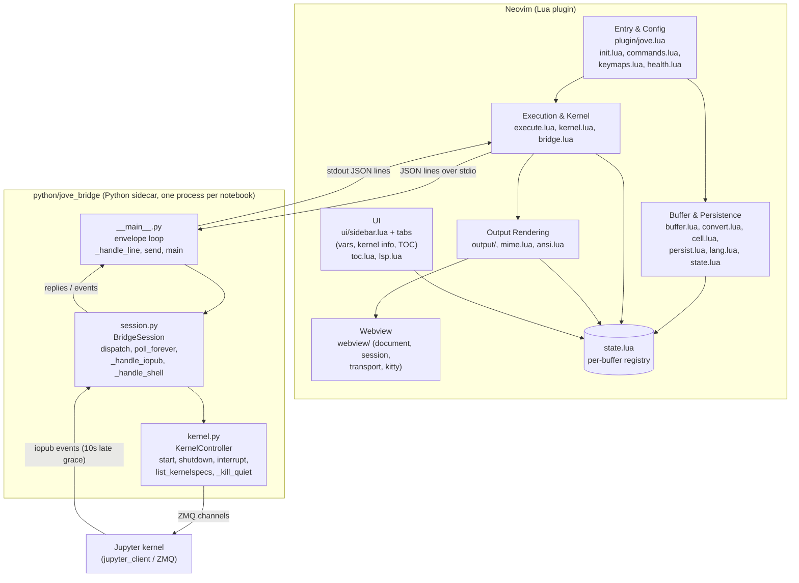

# jove.nvim Architecture

This document describes the architecture of jove.nvim, a Neovim plugin (Lua) that
edits Jupyter `.ipynb` notebooks as native buffers, plus a Python sidecar that
owns one Jupyter kernel per notebook. It was generated from the GitNexus
knowledge graph (291 symbols, 501 edges, 10 functional clusters, 19 execution
flows) combined with the repository's module layout.

At a high level there are two cooperating processes:

- **The Neovim plugin (Lua, `lua/jove/`)** — owns buffer editing, cell
  bookkeeping, configuration, execution orchestration, and output rendering.
- **The Python sidecar (`python/jove_bridge/`)** — a stdio JSON-lines server
  that owns exactly one Jupyter kernel per notebook, launched on demand by the
  Lua client (`lua/jove/bridge.lua` via `lua/jove/kernel.lua`).

```
Neovim (Lua plugin)  --JSON lines over stdio-->  python -m jove_bridge  --ZMQ-->  Jupyter kernel
```

## Functional Areas

### 1. Entry, config, and commands (Lua)

- `plugin/jove.lua` — startup entry; registers `BufReadCmd`/`BufWriteCmd`/
  `FileChangedShell` autocommands on `*.ipynb` and all `:Jove*` commands.
  Detects conflicts with `jupytext.nvim`.
- `lua/jove/init.lua` — `require("jove").setup`; the single config owner
  (`M.config`, `KNOWN_KEYS`). Keymaps are `<Plug>`-only in `keymaps.lua`.
- `lua/jove/commands.lua`, `lua/jove/keymaps.lua` — user commands and keymaps.
- `lua/jove/health.lua` — `:checkhealth` reporting.

### 2. Buffer, conversion, and persistence (Lua)

- `lua/jove/buffer.lua` — read/write/reload handlers; strips/restores the
  jupytext front matter (`# ---` fenced header) and schedules completion
  bookkeeping onto the main loop.
- `lua/jove/convert.lua` — async `.ipynb` <-> text conversion via the
  `jupytext` CLI.
- `lua/jove/cell.lua` — cell splitting/merging around `# %%`-style markers.
- `lua/jove/persist.lua` — merges session outputs into the `.ipynb` JSON on
  write and replays them on read; outputs are matched to cells by **content
  hash** (jupytext round-trips drop cell ids).
- `lua/jove/lang.lua` — language registry mapping kernelspec language ->
  filetype, jupytext stem, comment leader, known LSP servers.
- `lua/jove/state.lua` — per-buffer state registry (`state.get(buf)`), cleaned
  up on `BufWipeout`; other modules attach slots (`cells`, `kernel`, `exec`,
  `outputs`, `front_matter`).

### 3. Execution and kernel management (Lua)

- `lua/jove/execute.lua` — runs cells through the kernel, tracks the current
  run's wire key so reruns invalidate previous output routing.
- `lua/jove/kernel.lua` — one bridge handle (one sidecar process, one kernel)
  per buffer.
- `lua/jove/bridge.lua` — JSON-lines client to `python -m jove_bridge`.

### 4. Output rendering (Lua)

- `lua/jove/output/init.lua` — output storage and inline extmark placement.
- `lua/jove/output/render.lua` — pure chunks-to-virt_lines pipeline.
- `lua/jove/output/float.lua` — full-output float viewer.
- `lua/jove/mime.lua`, `lua/jove/ansi.lua` — MIME bundle handling and ANSI SGR
  parsing (stream events are stateful across events; error tracebacks are
  stripped, raw bytes persisted either way).
- `lua/jove/webview/` — terminal-browser webview for rich HTML/MIME outputs:
  `init.lua` (entry) delegates to `document.lua` (MIME-to-HTML rendering),
  `session.lua`/`transport.lua` (terminal-buffer lifecycle), `kitty.lua`
  (Kitty graphics protocol relay), `impl.lua` (test seam).
- `lua/jove/ui/` — `sidebar.lua` (single tabbed pane: variables, kernel info,
  TOC; number keys switch tabs), `panel.lua`, `win.lua`, `chrome.lua`,
  `vars.lua`, `image.lua` (optional `snacks.image` support).
- `lua/jove/toc.lua` — table-of-contents support for the sidebar.
- `lua/jove/lsp.lua` — opt-in LSP auto-attach; only starts servers with an
  existing `vim.lsp.config` entry.

### 5. Python sidecar (`python/jove_bridge/`)

The knowledge graph's cluster analysis resolves this area most precisely (36
symbols, 77% cohesion, split across four sub-clusters covering the envelope
loop, session dispatch, and kernel control):

- `__main__.py` — the envelope loop: reads JSON-lines requests on stdin,
  dispatches to the session, and writes replies through a bounded writer
  queue (`send`, `send_event`, `send_error`). Handles signals and stdin-EOF
  shutdown. Threads only (main + one poll worker + writer); no asyncio.
- `session.py` — `BridgeSession`: method dispatch (`dispatch`), kernel
  lifecycle (`start_kernel`, `_probe_ready`, `restart`, `shutdown_kernel`),
  shell-channel request submission (`execute`, `inspect`, `complete`,
  `variables` all funnel through `_submit_shell` -> `require_client`), and
  iopub/shell routing (`poll_forever` -> `_handle_iopub` / `_handle_shell`)
  with a 10-second late-iopub grace window.
- `kernel.py` — `KernelController`: a thin `jupyter_client` wrapper
  (`start`, `shutdown`, `interrupt`, `restart`, `list_kernelspecs`) raising
  `KernelError(code, msg)`; `_kill_quiet` is the last-resort process
  reaper used by every shutdown path.

### 6. Tests

- `tests/spec/*.lua` — mini.test specs (headless Neovim, real `jupytext`;
  cross-process specs inject fakes at `bridge_mod._impl`).
- `python/tests/*.py` — pytest suite for the sidecar against a registered
  `python3` kernelspec.

## Key Execution Flows (from the knowledge graph)

The graph's flow synthesis captured the sidecar's lifecycle most completely;
the five most significant traces follow.

### 1. Request handling -> kernel start -> kernelspec discovery (6 steps)

Every line arriving on stdin follows this spine. Kernelspec discovery is the
first thing a kernel start touches, and its failure is the most common startup
error path.

```
_handle_line  (python/jove_bridge/__main__.py)
dispatch      (python/jove_bridge/session.py)
start_kernel  (python/jove_bridge/session.py)
start         (python/jove_bridge/kernel.py)
require_kernelspec (python/jove_bridge/kernel.py)
list_kernelspecs   (python/jove_bridge/kernel.py)
```

### 2. Request handling -> kernel start -> failure containment (6 steps)

The twin of the flow above: when `start` fails, the same dispatch path
guarantees the half-started process is reaped so the bridge never leaks
kernels.

```
_handle_line  (python/jove_bridge/__main__.py)
dispatch      (python/jove_bridge/session.py)
start_kernel  (python/jove_bridge/session.py)
start         (python/jove_bridge/kernel.py)
shutdown      (python/jove_bridge/kernel.py)
_kill_quiet   (python/jove_bridge/kernel.py)
```

### 3. Request handling -> kernel readiness probe (4 steps)

After launching, `start_kernel` polls the kernel via `_probe_ready` before
reporting the kernel as ready to the Lua client.

```
_handle_line  (python/jove_bridge/__main__.py)
dispatch      (python/jove_bridge/session.py)
start_kernel  (python/jove_bridge/session.py)
_probe_ready  (python/jove_bridge/session.py)
```

### 4. Code execution -> shell-channel submission (3 steps)

The core execution request path. `execute`, `inspect`, `complete`, and
`variables` all share this shape: session method -> `_submit_shell` ->
`require_client` (which raises `KernelError` if the kernel died).

```
execute        (python/jove_bridge/session.py)
_submit_shell  (python/jove_bridge/session.py)
require_client (python/jove_bridge/kernel.py)
```

### 5. Background polling -> dead-kernel failure propagation (3 steps)

The poll worker's liveness check. When the kernel dies mid-run,
`_fail_pending` fails every queued request exactly once (no double
responses), and `_emit_error_output` synthesizes an error output the Lua
client can render.

```
poll_forever   (python/jove_bridge/session.py)
_check_alive   (python/jove_bridge/session.py)
_fail_pending  (python/jove_bridge/session.py)
```

A related flow worth noting is process shutdown: `main` ->
`shutdown_kernel` -> `shutdown` -> `_kill_quiet` — the same reaper that the
failure path uses, invoked on signal or stdin-EOF.

### Lua-side flows (not covered by graph flow synthesis)

The graph's flow traces cover the Python side; the Lua-side pipelines are
structural (documented from module layout):

- **Notebook read**: `BufReadCmd` -> `buffer.lua` -> `convert.lua` (async
  jupytext) -> front matter stripped, cells indexed into `state.cells` ->
  `persist.lua` replays persisted outputs.
- **Notebook write**: `BufWriteCmd` -> `buffer.lua` reassembles front matter ->
  `persist.lua` merges live session outputs into the `.ipynb` JSON by content
  hash -> `convert.lua` writes the file.
- **Cell execution**: `execute.lua` -> `kernel.lua` -> `bridge.lua` sends the
  request over stdio -> sidecar flows 1/4 above -> iopub events stream back ->
  `ansi.lua`/`mime.lua` parse -> `output/init.lua` places extmarks ->
  `output/render.lua` draws virtual lines (or `webview/` renders rich HTML).

## Architecture Diagram



## Diagram Notes and Caveats

- The diagram's Lua-side edges reflect module layout and ownership (from
  AGENTS.md and the repository structure); the GitNexus flow synthesis
  captured call-level traces for the Python sidecar only, because Lua
  `require`-based wiring is not resolved into symbol-level call edges by the
  current analyzer build.
- The sidecar's internal arrows are the knowledge graph's top-ranked
  cross-community flows; `poll_forever` runs on a dedicated worker thread,
  which is why output events can arrive after the execute reply.
- Every functional area attaches its state to the single per-buffer registry
  (`state.lua`), cleaned up on `BufWipeout`; the diagram collapses those
  attachments into one edge to the `state` node for readability.
